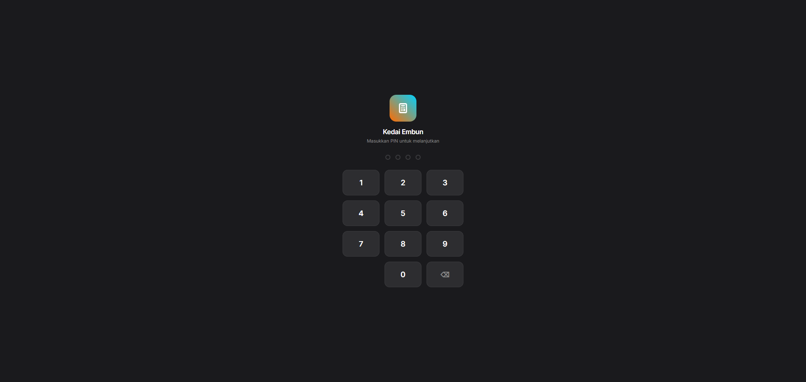
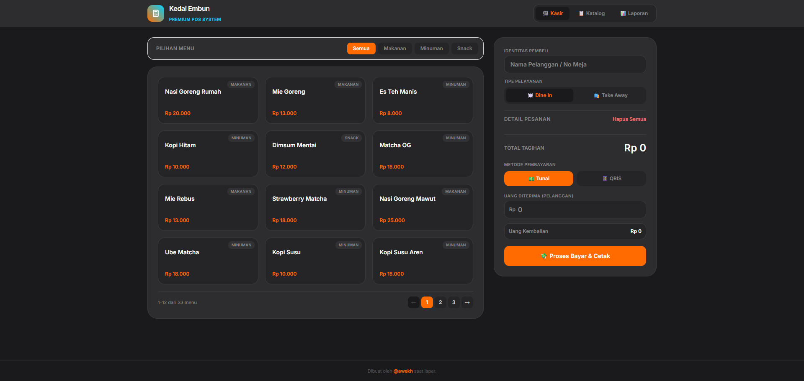
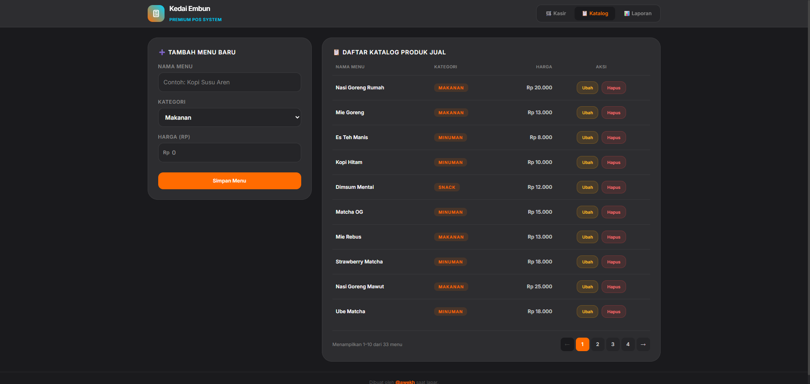
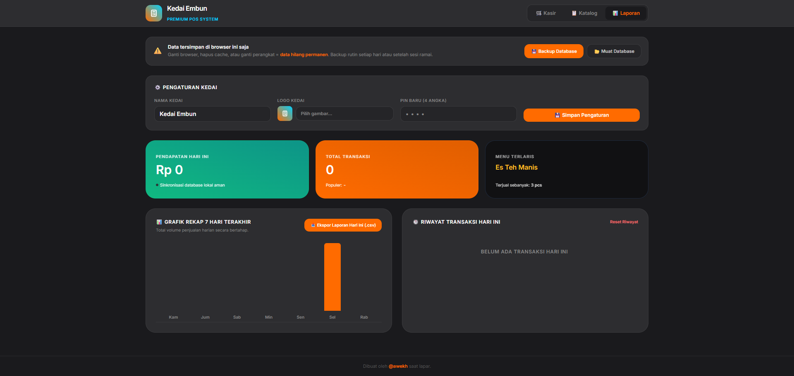

# 🛒 qasir — Aplikasi POS Gratis untuk UMKM


Aplikasi kasir berbasis web yang **gratis, ringan, dan bisa dipakai tanpa internet** setelah pertama kali dibuka. Dibuat khusus untuk warung, kedai, dan UMKM kecil yang butuh alat kasir sederhana tanpa biaya langganan.

---

## 📸 Tampilan Aplikasi

| Layar PIN | Halaman Kasir |
|---|---|
|  |  |

| Halaman Katalog | Halaman Laporan |
|---|---|
|  |  |

---

## ✨ Fitur Utama

- **🔐 Proteksi PIN** — Layar kunci numpad sebelum masuk aplikasi
- **🛒 Kasir** — Pilih menu, masukkan ke keranjang, proses pembayaran Tunai atau QRIS, cetak struk thermal
- **📋 Katalog Menu** — Tambah, ubah, hapus menu dengan kategori dan harga; pagination 10 item/halaman
- **📊 Laporan Harian** — Statistik pendapatan, total transaksi, menu terlaris, grafik 7 hari, ekspor CSV
- **💾 Backup & Restore** — Ekspor seluruh data (menu + transaksi) ke file `.json`, muat kembali kapan saja
- **⚙️ Pengaturan Kedai** — Ganti nama kedai, logo, dan PIN langsung dari halaman Laporan
- **📱 PWA / Offline** — Bisa dipasang seperti aplikasi di HP dan berjalan tanpa koneksi internet
- **🌙 Dark Mode** — Antarmuka gelap yang nyaman untuk dipakai seharian

---

## 🚀 Cara Instalasi

Lihat panduan lengkap di [`docs/tutorial-instalasi.md`](docs/tutorial-instalasi.md)

**Singkatnya:**
1. Unduh atau clone repository ini
2. Taruh semua file dalam satu folder
3. Buka `kasir.html` di browser atau `kasir-mobile.html` kalau menggunakan HP/Tablet
4. Masukkan PIN default: **`1234`**

> Tidak butuh Node.js, server, atau koneksi internet permanen.

---

## 📖 Cara Penggunaan

Lihat panduan lengkap di [`docs/tutorial-penggunaan.md`](docs/tutorial-penggunaan.md)

---

## 📁 Struktur File

```
kasir-kedai/
├── kasir.html          # Halaman utama aplikasi
├── kasir-mobile.html   # Halaman utama aplikasi khusus HP/Tablet
├── kasir.css           # Stylesheet (dark theme + custom)
├── kasir.js            # Logika aplikasi
├── sw.js               # Service worker (offline support)
├── README.md           # File ini
└── docs/
    ├── tutorial-instalasi.md
    ├── tutorial-penggunaan.md
    └── screenshot/
        ├── tutorial_01_layar-pin.png
        ├── tutorial_02_halaman-kasir.png
        ├── tutorial_03_halaman-katalog.png
        └── tutorial_04_halaman-laporan.png
```

---

## 🛠️ Teknologi

| Komponen | Teknologi |
|---|---|
| Tampilan | HTML5, Tailwind CSS, CSS Custom Properties |
| Logika | JavaScript Vanilla (ES6+) |
| Penyimpanan | Browser `localStorage` |
| Offline | Service Worker (PWA) |
| Font | Inter (Google Fonts) |

> **Catatan penting:** Data tersimpan di browser masing-masing perangkat. Gunakan fitur **Backup Database** secara rutin untuk menghindari kehilangan data.

---

## ⚠️ Keterbatasan

- Data tidak tersinkronisasi antar perangkat secara otomatis (perlu backup manual)
- Belum mendukung multi-kasir dalam satu waktu
- Printer thermal perlu dikalibrasi lewat pengaturan browser masing-masing

---

## 📄 Lisensi

Proyek ini menggunakan lisensi **MIT** — bebas dipakai, dimodifikasi, dan disebarluaskan untuk keperluan apapun, termasuk komersial, selama mencantumkan atribusi.

---

## 👤 Pembuat

Dibuat oleh **[@awekh](https://qata.my.id/awekh)**

Jika aplikasi ini bermanfaat, silakan ⭐ repository ini dan bagikan ke sesama pelaku UMKM!
